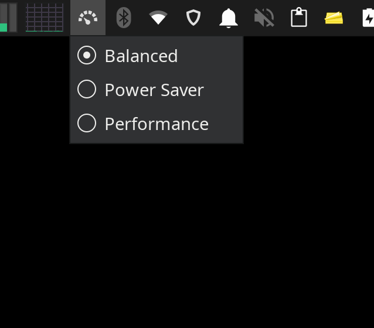

# Powermode Indicator

It is a plugin for all desktops supported by libappindicator. It provides menu to choose power profiles.

I do use it on my system. I would love to see contributions and bug reports. 

> It depends on [power-profiles-daemon](https://archlinux.org/packages/extra/x86_64/power-profiles-daemon/)



## Installation

### Arch Linux
``` bash
paru -S powermode-indicator-git
```

## How to run?

The indicator shows up in Status Tray once `powermode-indicator` command is executed.

I would recommend you to add it in autostart script.

