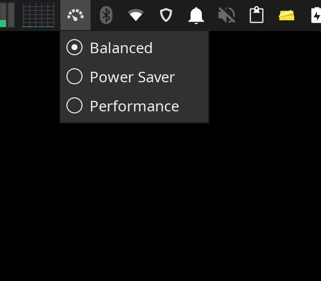

# Powermode Indicator

A system tray indicator for switching power profiles on Linux. Works on any desktop supported by libappindicator.

> Requires [power-profiles-daemon](https://archlinux.org/packages/extra/x86_64/power-profiles-daemon/)



## Features

- Switch between **Balanced**, **Power Saver**, and **Performance** profiles from the system tray
- Instant profile change detection via D-Bus signals (no polling)
- Tooltip showing the active profile name
- Icons sourced from the system theme; Papirus icons bundled as fallback (dark/light variants auto-detected)

## Installation

### Arch Linux

```bash
paru -S powermode-indicator-git
```

### Ubuntu / Debian

Download the `.deb` from [Releases](../../releases) and install:

```bash
sudo dpkg -i powermode-indicator_*.deb
```

### Fedora / RPM-based

Download the `.rpm` from [Releases](../../releases) and install:

```bash
sudo rpm -i powermode-indicator_*.rpm
```

### Build from source

**Dependencies:**

| Package | Version |
|---|---|
| cmake | ≥ 3.16 |
| gtkmm | 3.0 |
| glibmm | 2.4 |
| giomm | 2.4 |
| appindicator3 | 0.1 |
| glib2 (glib-compile-resources) | — |
| gcc or clang | — |
| pkg-config | — |

**Steps:**

```bash
git clone https://github.com/PiyushXCoder/powermode-indicator
cd powermode-indicator
cmake -B build -G Ninja -DCMAKE_BUILD_TYPE=Release
cmake --build build
sudo cmake --install build
```

## Autostart

To launch on login, create `~/.config/autostart/powermode-indicator.desktop`:

```ini
[Desktop Entry]
Type=Application
Name=Powermode Indicator
Exec=powermode-indicator
X-GNOME-Autostart-enabled=true
```

## Troubleshooting

**Profile mode missing from menu**
Only profiles supported by your hardware are shown. Check available profiles:
```bash
powerprofilesctl
```

**Icons not showing**
Icons are loaded from the active icon theme. If the theme lacks them, bundled Papirus icons are used automatically. If neither works, install [Papirus](https://github.com/PapirusDevelopmentGroup/papirus-icon-theme) or another complete icon theme.

## Contributing

Bug reports and pull requests are welcome.
